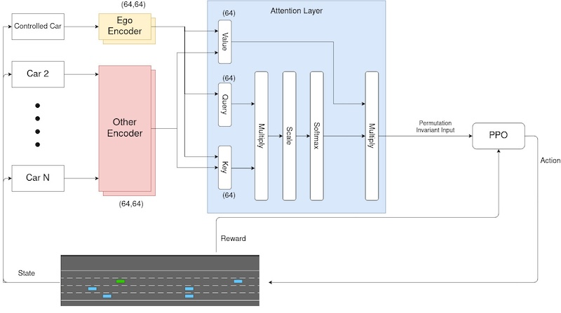

# Deep Reinforcement Learning for Autonomous Car Application

This project is about deep reinforcement learning application into autonomous car simulation as part my undergraduate thesis final year project.

This project run multiple reinforcement learning algorithm into multiple environment, before conclude the project by running algorithm into autonomous vehicle simulation by https://github.com/Farama-Foundation/HighwayEnv

### Architecture

I utilize attention architecture to pre-process the data before putting it into Reinforcement Learning agent to improve the result. Complete report can click [here](<assets/Final Year Project - Faza Muhammad Allam.pdf>)
